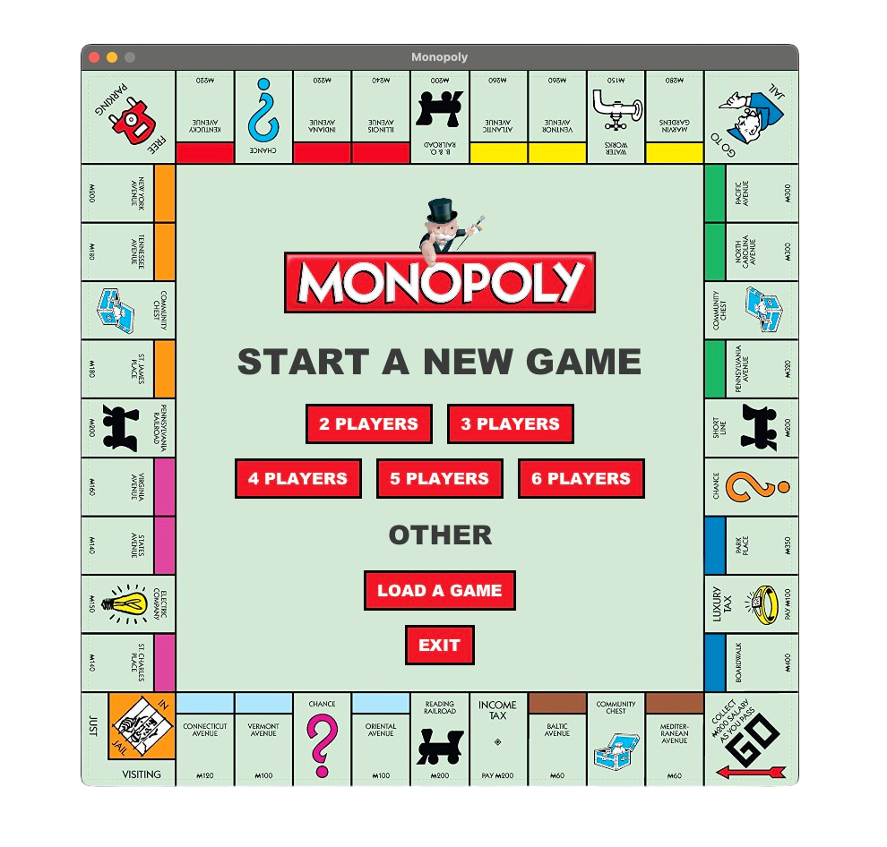
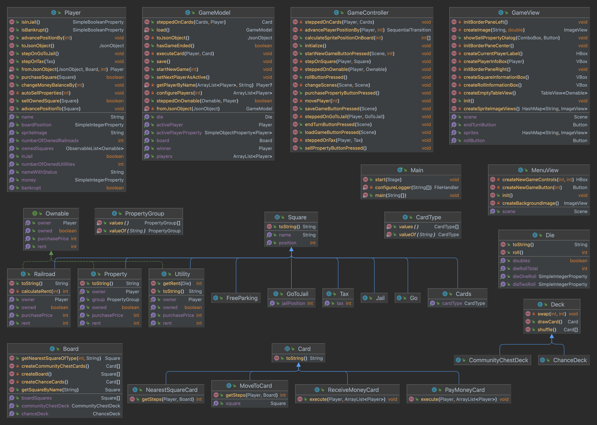

# Monopoly JavaFX
This project is a recreation of the classic Monopoly board game.<br>
The application is written in Java and features a GUI written in JavaFX.



## Table of Contents
  - [Installation](#installation)
  - [Usage](#usage)
  - [Game features](#game-features)
  - [Game rules and mechanics](#game-rules-and-mechanics)
  - [Configure logging](#configure-logging)
  - [Save game file format](#save-game-file-format)
  - [Data Object Model](#data-object-model)

## Installation
To run the app you need to have installed:
- **Java 17**
- **Maven**<br>

Dependencies automatically maintained by **Maven**:
- `org.openjfx: javafx-controls: 19`
- `com.github.cliftonlabs: json-simple: 4.0.1`
- `org.junit.jupiter: junit-jupiter: 5.9.2`
- `org.mockito: mockito-core: 5.3.1`

## Usage
1. Clone the repository.
2. Navigate to the *monopoly-javafx/monopoly* directory: `$ cd monopoly-javafx/monopoly`
3. Start the application: `$ mvn clean javafx:run`<br>

Alternatively, use an IDE of your choice and set a run configuration.

## Game features
- 2-6 players
- Dice rolling
- Bankrupt, Jail time
- Property management
  - Collect & pay rent
  - Purchase & sell properties
- Jail, Free Parking, Properties, Utilities, Railroads
- Chance deck & Community Chest deck
  - Collect money & collect money from each player
  - Pay money & pay money to each player
  - Advance to a specific square
  - Advance to the nearest Utility or Railroad
- Game board with original sprites & animations
- Players' statistics & overview
- Save & load game

## Game rules and mechanics
Monopoly is a complex game full of rules and exceptions. There is a list of the most important rules that were implemented:<br>
- Player receives $200 after passing the GO square (not if the player is going to Jail)
- During a player's turn, the player can buy and sell Properties.
- If a player rolls doubles, the player have the opportunity to roll the dice again.
- When a player does not have sufficient funds to cover a debt, the game automatically sells off the player's properties to compensate for the shortage.
- When a player goes bankrupt, the player is eliminated from the game.
- There's an automatic roll dice, if player steps on a Utility owned by another Player, in order to determine the rent of the Utility.
- To get out of Jail player needs to roll a double. The player has only one try to roll double.

Note: Hotels & Mortgages game mechanics were not implemented.

## Configure logging
The application enables logging.<br>

`<log-level>` options:
- `INFO` - basic logging (recommended)
- `FINE` - more detailed logging
- `ALL` - the most comprehensive logging<br>

Firstly, compile the application:
```shell
$ mvn compile
```
Secondly, run the compiled application with a selected `<log-level>`:
```shell
$ mvn exec:java -Dexec.mainClass=cz.cvut.fel.pvj.nejedly.monopoly.Main -Dexec.args="<log-level>"
```
The logs can be found in `nejedpe4/monopoly/log.txt`.

## Save game file format
The application enables you save and load a game. An example of `saved-game.json` file.
```json
{
  "activePlayer": "Alice",
  "players": [
    {
      "ownedSquares": [
        18, 26
      ],
      "isInJail": false,
      "money": 1250,
      "name": "Alice",
      "isBankrupt": false,
      "boardPosition": 4
    },
    {
      "ownedSquares": [
        2, 11
      ],
      "isInJail": true,
      "money": 700,
      "name": "Bob",
      "isBankrupt": false,
      "boardPosition": 10
    }
  ]
}
```

## Data Object Model
The application follows the MCV architecture for better organization and flexibility.


***
**Note:** The JavaFX Monopoly board game was my semester project for the subject "Programming in JAVA" (B0B36PJV) at CTU in Prague.